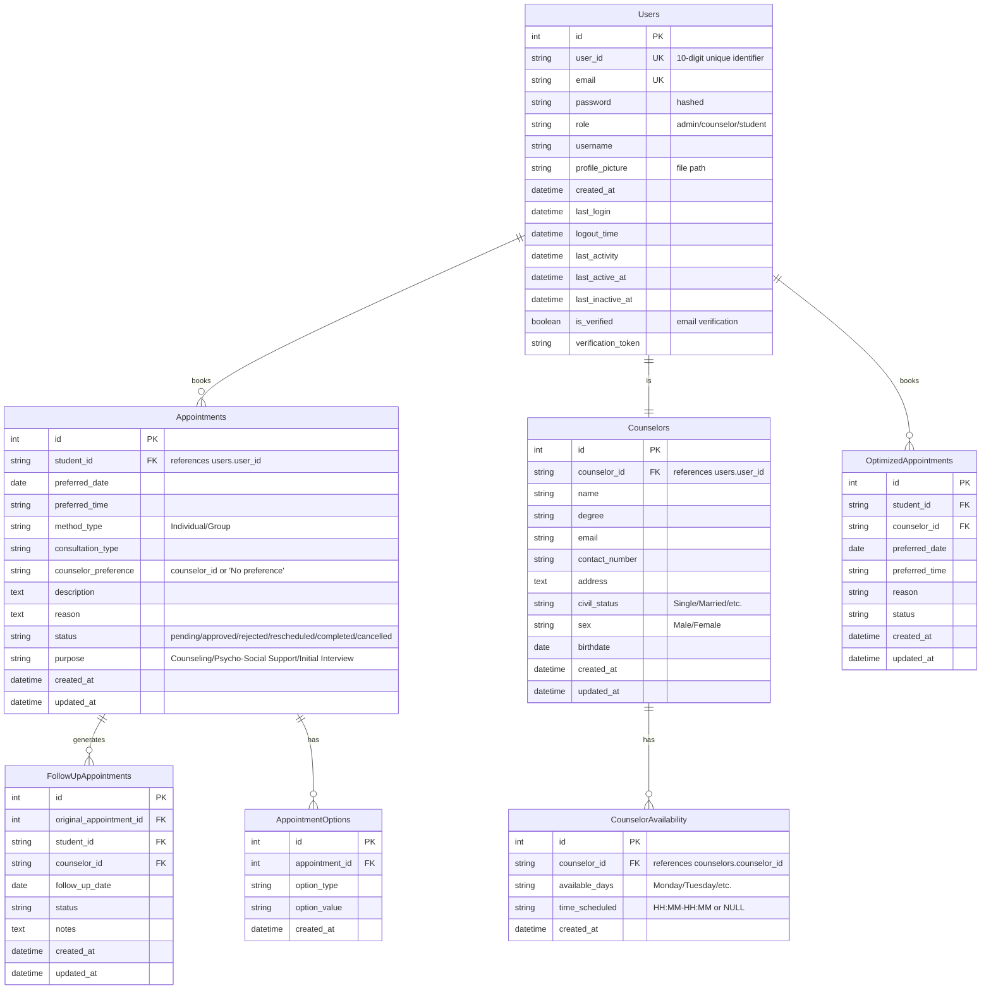
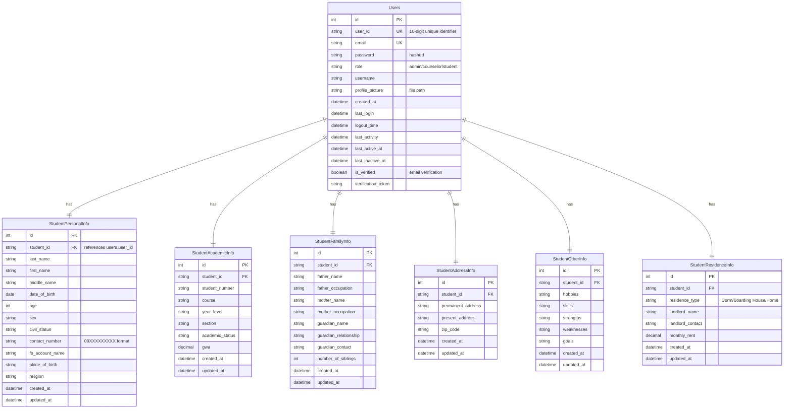
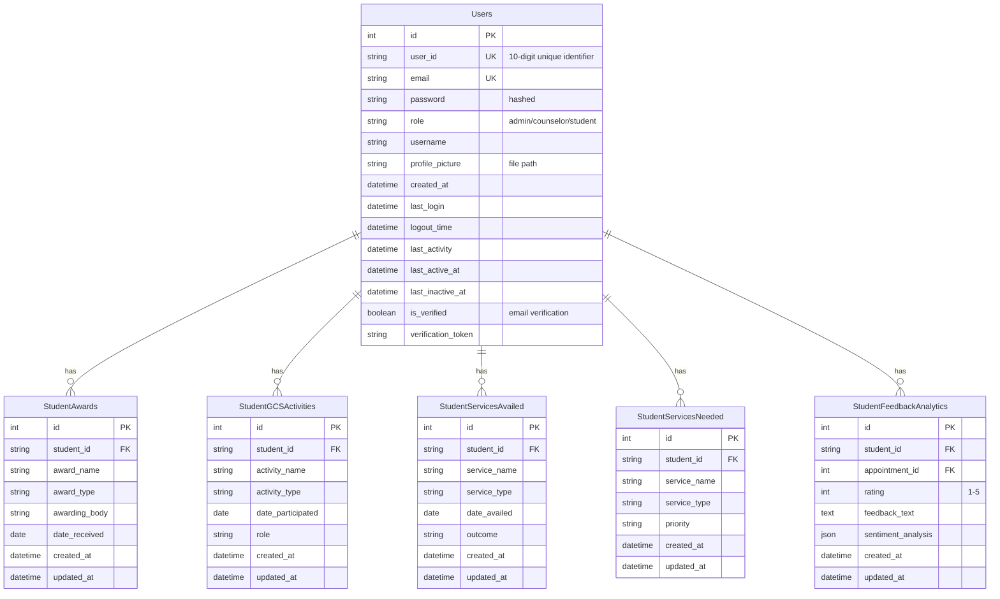
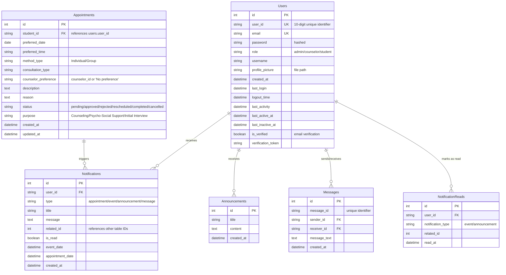
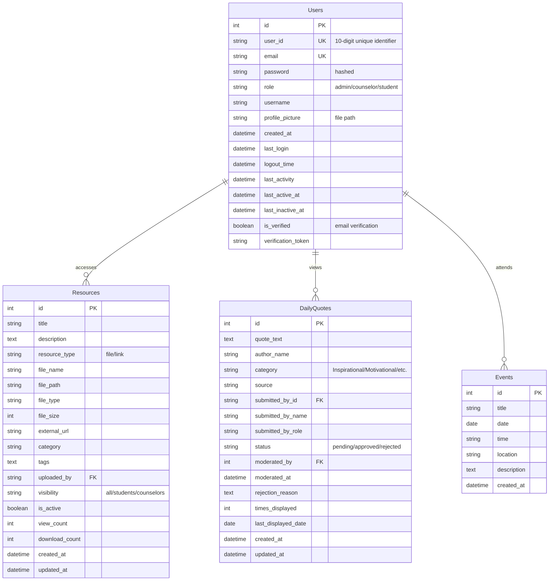

# ERD (Entity Relationship Diagram)

This Entity Relationship Diagram shows the relationships between all entities in the Counselign system, including users, appointments, counselors, student information, notifications, and system resources. Split into multiple diagrams for A4 portrait printing.

## 1. Core Entities: Users, Appointments, and Counselors

## 2. Student Information Entities

## 3. Student Activities and Feedback Entities

## 4. Communications and Notifications Entities

## 5. Resources and Events Entities

