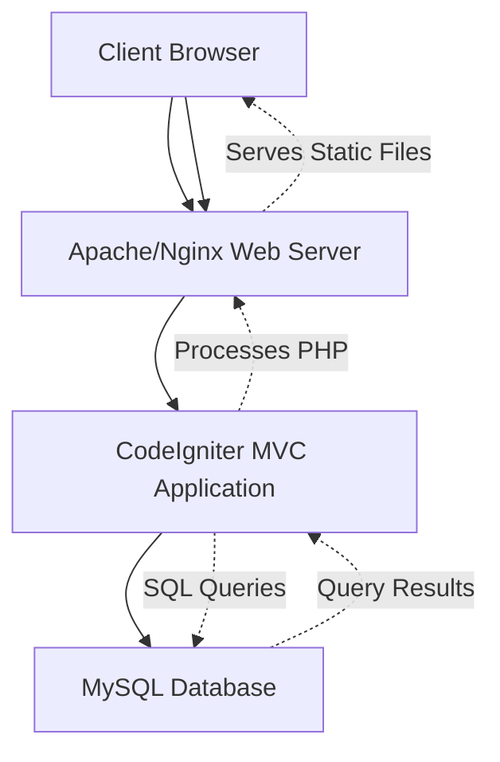

# System Architecture

## Overview

The Counselign system follows a WAMP (Windows/Apache/MySQL/PHP) stack architecture for development using XAMPP, and can be deployed on LAMP (Linux/Apache/MySQL/PHP) stack in production. CodeIgniter 4 serves as the complete application framework, handling all business logic, database operations, API endpoints, and user interactions.

## High-Level Architecture

### Architecture Layers

- **Frontend Layer**: HTML/PHP views with JavaScript for client-side interactions
- **Application Layer**: CodeIgniter framework handling business logic, API endpoints, and database operations
- **Database Layer**: MySQL database for data persistence

### Component Diagram



## Architecture Components

### 1. Client Layer
- **Web Browsers**: Chrome, Firefox, Safari, Edge
- **Mobile Browsers**: Responsive design support
- **JavaScript**: Client-side interactivity and AJAX calls

### 2. Web Server Layer
- **Apache HTTP Server**: Primary web server in development/production
- **Nginx**: Alternative web server option for production
- **PHP Processing**: Server-side PHP execution
- **Static File Serving**: CSS, JavaScript, images, documents

### 3. Application Layer
- **CodeIgniter Framework**: MVC architecture implementation
- **Controllers**: Handle HTTP requests and responses
- **Models**: Database interaction and business logic
- **Views**: Presentation layer (HTML/PHP templates)
- **Libraries**: Reusable code components
- **Helpers**: Utility functions
- **Routes**: URL routing configuration

### 4. Database Layer
- **MySQL Database**: Primary data storage
- **InnoDB Engine**: ACID compliance and foreign key support
- **Connection Pooling**: Efficient database connections
- **Query Optimization**: Indexed tables and optimized queries

## Application Structure

```
Counselign/
├── app/
│   ├── Config/          # Configuration files
│   ├── Controllers/     # Request handlers
│   ├── Models/          # Database models
│   ├── Views/           # HTML templates
│   ├── Helpers/         # Utility functions
│   ├── Libraries/       # Custom libraries
│   └── Database/        # Migrations/Seeds
├── public/              # Web-accessible files
│   ├── css/            # Stylesheets
│   ├── js/             # JavaScript files
│   └── Photos/         # Images and assets
├── writable/            # File uploads and cache
│   ├── uploads/        # User uploaded files
│   └── session/        # Session data
└── docs/               # Documentation
```

## Data Flow

### Request Flow
1. **Client Request**: User interacts with web interface
2. **Web Server**: Receives HTTP request, routes to PHP
3. **CodeIgniter**: Processes request through MVC layers
4. **Database Query**: Models execute SQL queries
5. **Response Generation**: Views render HTML response
6. **Client Response**: Browser receives and displays content

### Authentication Flow
1. **Login Request**: User submits credentials
2. **Validation**: Controller validates input
3. **Database Check**: Model queries user table
4. **Session Creation**: Successful login creates session
5. **Role Assignment**: User role determines accessible features
6. **Dashboard Redirect**: User directed to appropriate dashboard

### Appointment Booking Flow
1. **Form Submission**: Student fills appointment form
2. **Validation**: Server-side validation of all fields
3. **Availability Check**: Verify counselor availability
4. **Database Insert**: Create appointment record
5. **Notification**: Send confirmation to student
6. **Status Update**: Appointment marked as 'pending'

## Security Architecture

### Authentication & Authorization
- **Session Management**: PHP sessions with secure configuration
- **Role-Based Access**: Different permissions per user role
- **Password Security**: Bcrypt hashing with salt
- **Email Verification**: Account activation via email tokens

### Input Security
- **CSRF Protection**: CodeIgniter's built-in CSRF tokens
- **XSS Prevention**: Automatic escaping of output
- **SQL Injection**: Prepared statements and ORM protection
- **Input Validation**: Server-side validation rules

### Data Security
- **Encryption**: Sensitive data encryption at rest
- **HTTPS**: SSL/TLS encryption in production
- **File Upload Security**: File type and size restrictions
- **Session Security**: Secure session cookie settings

## Performance Considerations

### Database Optimization
- **Indexing**: Strategic indexes on frequently queried columns
- **Query Optimization**: Efficient SQL queries and joins
- **Connection Pooling**: Database connection reuse
- **Caching**: Query result caching where appropriate

### Application Performance
- **CodeIgniter Caching**: Built-in caching mechanisms
- **Asset Optimization**: Minified CSS and JavaScript
- **Image Optimization**: Compressed images and lazy loading
- **CDN Integration**: Static asset delivery optimization

## Deployment Architecture

### Development Environment
- **XAMPP Stack**: Windows, Apache, MySQL, PHP integrated package
- **Local Database**: MySQL instance on localhost
- **File Permissions**: Writable directories for uploads/cache
- **Error Reporting**: Full error display for debugging

### Production Environment
- **LAMP Stack**: Linux, Apache, MySQL, PHP (recommended)
- **WAMP Stack**: Windows, Apache, MySQL, PHP (alternative)
- **Load Balancing**: Multiple web servers if needed
- **Database Clustering**: Master-slave replication for high availability
- **Backup Strategy**: Automated database and file backups

## Scalability Features

### Horizontal Scaling
- **Session Storage**: Database-backed sessions for load balancing
- **Shared Storage**: Network file system for uploaded files
- **Database Sharding**: Potential for future data partitioning

### Vertical Scaling
- **Memory Optimization**: Efficient PHP memory usage
- **Database Tuning**: Optimized MySQL configuration
- **Caching Layers**: Redis/Memcached integration ready

## Technologies Used

- **Backend Framework**: PHP 8+ with CodeIgniter 4
- **Database**: MySQL 8.0+
- **Frontend**: HTML5, CSS3, JavaScript (ES6+)
- **Web Server**: Apache 2.4+ or Nginx 1.20+
- **PHP Extensions**: Required CodeIgniter extensions
- **Development Tools**: XAMPP, Composer, Git

## Environment Configuration

### Development
```php
// app/Config/App.php
public string $baseURL = 'http://localhost/Counselign/';
public string $indexPage = 'index.php';
public bool $debug = true;
```

### Production
```php
// app/Config/App.php
public string $baseURL = 'https://yourdomain.com/';
public string $indexPage = '';
public bool $debug = false;
```

## Monitoring & Maintenance

### Application Monitoring
- **Error Logging**: CodeIgniter's logging system
- **Performance Monitoring**: Response times and resource usage
- **Database Monitoring**: Query performance and connection status
- **User Activity**: Login/logout and feature usage tracking

### Maintenance Tasks
- **Database Backups**: Automated daily backups
- **Log Rotation**: Regular log file cleanup
- **Cache Clearing**: Periodic cache maintenance
- **Security Updates**: Regular framework and dependency updates