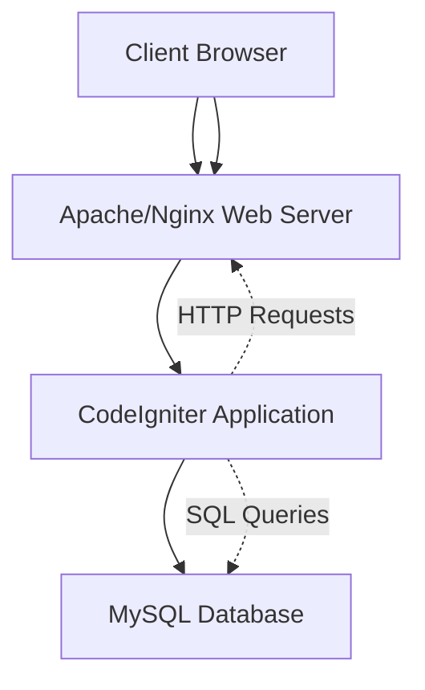
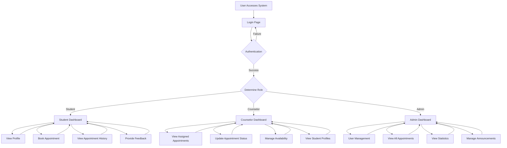
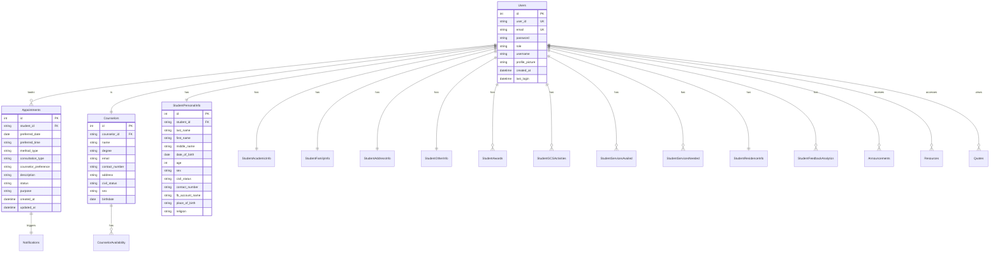

# System Design

## Overview

The Counselign system is a comprehensive counseling management platform built for educational institutions to facilitate student-counselor interactions through appointment scheduling and tracking.

## System Architecture

### High-Level Architecture

- **Frontend Layer**: HTML/PHP views with JavaScript for client-side interactions
- **Application Layer**: CodeIgniter framework handling business logic, API endpoints, and database operations
- **Database Layer**: MySQL database for data persistence

### Component Diagram

## Database Schema

Based on the models, the key tables are:

### Users Table
- id (PK)
- user_id (unique, 10 chars)
- email
- password
- role (admin, counselor, student)
- verification_token
- is_verified
- username
- profile_picture
- created_at, last_login, etc.

### Appointments Table
- id (PK)
- student_id (FK to users.user_id)
- preferred_date
- preferred_time
- method_type
- consultation_type
- counselor_preference
- description, reason
- status (pending, approved, rejected, etc.)
- purpose (Counseling, Psycho-Social Support, Initial Interview)
- created_at, updated_at

### Counselors Table
- id (PK)
- counselor_id (FK to users.user_id)
- name, degree, email, contact_number, address
- civil_status, sex, birthdate

### Student Information Tables
- student_personal_info
- student_academic_info
- student_family_info
- student_address_info
- student_other_info
- student_awards
- student_gcs_activities
- student_services_availed
- student_services_needed
- student_residence_info
- student_feedback_analytics

### Other Tables
- counselor_availability
- notifications
- announcements
- quotes
- resources

## User Roles and Permissions

1. **Student**
   - View own profile
   - Book appointments
   - View appointment history
   - Provide feedback

2. **Counselor**
   - View assigned appointments
   - Update appointment status
   - View student profiles (with permission)
   - Manage availability

3. **Admin**
   - Full system access
   - User management
   - View all appointments and statistics
   - Manage announcements and resources

## Key Features

- Appointment scheduling and management
- User authentication and verification
- Role-based access control
- Counselor availability management
- Student profile management
- Appointment status tracking
- Dashboard analytics
- Follow-up session management
- History reports

## System Flowchart

## ERD (Entity Relationship Diagram)

## Database Schema

(Details above in Database Schema section)

## Security Considerations

- Password hashing
- Email verification
- Role-based access
- Input validation
- SQL injection prevention via CodeIgniter ORM
- CSRF protection via CodeIgniter security features

## Technologies Used

- Backend: PHP 8+ (CodeIgniter 4)
- Database: MySQL
- Frontend: HTML5, CSS3, JavaScript
- Web Server: Apache/XAMPP

## Deployment

- Local development: XAMPP
- Production: Standard LAMP stack