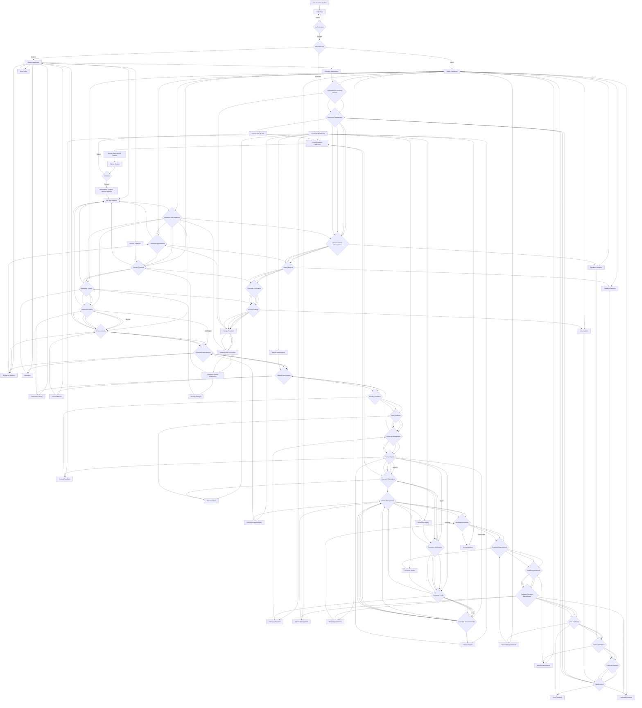

# System Flowchart

This flowchart illustrates the complete user journey through the Counselign counseling management system, covering all implemented features and functions for each user role (Student, Counselor, Admin).

